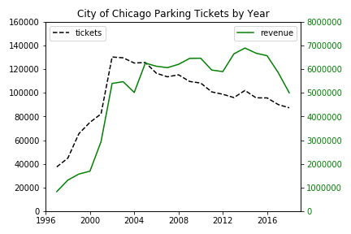
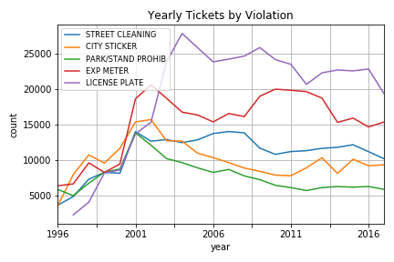
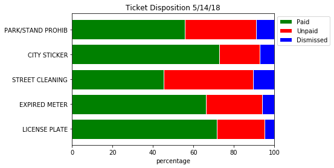
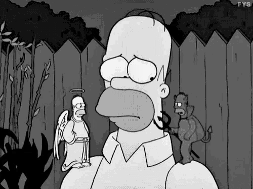
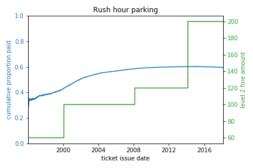
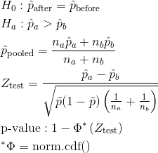

# City of Chicago Parking Tickets
## Data Exploration and Revenue Development Strategies

### Background and Motivation
The City of Chicago has a long history of corruption dating back over 150 years.(source) A 2019 report by the Illinois Policy Institute estimated that public corruption convictions cost the Illinois state economy $9.9 billion between 2000-2017, with further detrimental effects on economic competitiveness and growth. (source) In order to maintain its reputation as the most corrupt city in America, Chicago must explore ways to unlock the full potential of its municipal revenue streams.

### Data Description
ProPublica, an investigative journalism organization, has compiled a data set of parking and vehicle compliance tickets issued in Chicago from January 1, 1996 to May 14, 2018. The same data are available from the City of Chicago through FOIA (Free of Information Act) requests. In addition to the 22 features provided by the City of Chicago, ProPublica also engineered 14 additional features containing geographic information about where the ticket was issued. ProPublica also compiled a data set of speeding and red light camera violation tickets in a separate csv but I did not use that data in this project.

At a high level, the data set contains information about when, where, and by whom tickets were issued, hashed license plate numbers, vehicle makes, vehicle registration zipcodes, the violation for which the vehicle was cited, payment status and more.

### Data Pipeline
The uncompressed csv containing the data is 19.6 GB and contains 54,430,547 records, far too large to load completely into a single computer's memory. I used Unix commands to systematically sample every 25th record, producing a subset containing 2,177,221 records that consumed 650 MB in memory. The pandas software library was used to examine, plot and analyze this subset of data.

### Data Exploration
This section contains plots that demonstrate the types of information that can be gleaned from this feature-rich data set.

#### Tickets Issued by Year and Fines Paid by Year

This is a plot of the number of tickets issued by the City of Chicago and the total fines paid aggregated by year. It can be observed that although the number of tickets issued has declined since 2002, the revenue drawn by the city has been robust to that decline. I believe the low number of ticket issued before 2002 indicates a data completeness issue, where not all violations have ticket information dating as far back as 1996.

#### Top Ticketed Violations by Year

Violations are coded alphanumerically by the City of Chicago, but some violation codes have been split into subcodes over time, like city sticker violations:

| violation code |                violation description               |
|:--------------:|:--------------------------------------------------:|
| 0964125        | NO CITY STICKER OR IMPROPER DISPLAY                |
| 0964125B       | NO CITY STICKER VEHICLE UNDER/EQUAL TO 16,000 LBS. |
| 0964125C       | NO CITY STICKER VEHICLE OVER 16,000 LBS.           |
| 0964125D       | IMPROPER DISPLAY OF CITY STICKER                   |

I aggregated ticket data on only the numeric portion of violation codes and plotted any violations that were among the top 2 most ticketed violations in a given year.

#### Violations Generating the Most Revenue (FY 2017)

|   Code   |               Violation Description               | FY2017 Revenue |
|:--------:|:-------------------------------------------------:|:--------------:|
| 0964125B | No city sticker vehicle under/equal to 16,000 lbs | \$924,032.51    |
| 0964040B | Street cleaning                                   | \$544,842.56    |
| 0964090E | Residential permit parking                        | \$501,186.09    |
| 0964190A | Exp. meter non-central business district          | \$411,177.41    |
| 0964150B | Parking/standing prohibited anytime               | \$338,213.08    |

The City of Chicago fiscal year runs from Jan 1 to Dec 31. The 5 violation codes generating the most revenue for FY 2017, the last complete year in the data set, are listed above. This ranking does not perfectly match the violations generating the most tickets because fines differ for each violation.

#### Disposition of Selected Violations

Aside from information about whether a ticket was paid or unpaid, other ticket outcomes were also included in the data set. For example, some tickets were dismissed, awaiting a hearing, or in bankruptcy. I binned tickets into paid, unpaid, and dismissed categories, in order to visualize the efficiency of the ticketing process. A violation that is unpaid or dismissed generates no revenue for the city. For reasons that require further exploration of the data, street cleaning tickets are paid less often than city sticker and license plate violation tickets.

#### Table View of Individual Vehicle

|      issue date     |          geocoded address         |           violation description          | license plate_type | current amount_due | total payments |
|:-------------------:|:---------------------------------:|:----------------------------------------:|:------------------:|:------------------:|:--------------:|
| 2000-05-06 09:25:00 | 200 S Clark St, Chicago, IL 60604 | PARKING/STANDING PROHIBITED ANYTIME      | TRK                | 0                  | 100            |
| 2000-05-15 17:41:00 | Chicago, IL 60601                 | PARKING/STANDING PROHIBITED ANYTIME      | PAS                | 50                 | 0              |
| 2000-06-22 17:41:00 | 300 S Clark St, Chicago, IL 60605 | WITHIN 15' OF FIRE HYDRANT               | TRK                | 0                  | 200            |
| 2000-08-10 15:54:00 | 300 S Clark St, Chicago, IL 60605 | PARK OR STAND IN BUS/TAXI/CARRIAGE STAND | TRK                | 0                  | 60             |
| 2000-08-21 17:15:00 | 300 S Clark St, Chicago, IL 60605 | NO STANDING/PARKING TIME RESTRICTED      | TRK                | 0                  | 100            |

Using the hashed license plate numbers, a Chevy truck incurring 53 violations in the data subset was identified. The first 5 violations are shown in the view above. The license plate type corresponds to a commercial truck except in the second row, where the license plate was incorrectly identified as a passenger vehicle. The data set is full of inconsistencies and data entry errors, and I only endeavored to clean features where inconsistencies affected large proportions of values.

### Revenue Maximization Strategies

I originally hoped to follow in the footsteps of ProPublica and examine how fines burdened different segments of Chicago society, but big data presents different headaches than small data. The US Census Bureau has massive amounts of demographic information, like race and household income, but I have not been able to find the exact data set laid out in the right format to ease merging operations. This will be a direction for future analysis.

Absent external demographic information, I rescoped and determined that I could use the data at hand to investigate the levers the City of Chicago had access to to raise revenues.

#### Hypothesis Testing

Because the data span 22 years, it can be observed that fines for various violations have increased over time, while some violation fines have remained constant. Information can also be generated about the proportion of tickets that have been paid over windows of time. The plot above focuses on violations for Rush Hour Parking. The cumulative proportion of tickets paid and the level 1 fine amount are shown. I wanted to explore whether raising fines decreased the probability of violators paying. This can be detected by a change in the slope of the cumulative probability line (blue), but because there are so many observations, it is not possible to visually detect effects. A rolling window of probabilities would be a future visualization goal.

(Note: Level 1 fines are issued for violations, and level 2 fines are issued for continued noncompliance and/or unpaid tickets.)

#####  Difference in Proportions Test Review

##### Results
A six month window of records before and after a fine increase produced two samples for hypothesis testing. Some results follow:
(The p-value for a one-sided difference in proportions test between tickets issued before and after a price increase are shown)

###### Rush Hour Parking
Rush hour parking level 1 fine increased:
$30 > $50 (+67%) on 02/02/00 (p-val: 0.336)
$50 > $60 (+20%) on 02/19/08 (p-val: 0.345)
$60 > $100 (+67%) on 02/23/14 (p-val: 0.964)

Conclusion:
Rush hour parking fines were increased 3 times and a difference in proportions test was performed in the leading and trailing 6 months around the event. There was not enough evidence to reject the null hypothesis that raising ticket fines does not affect payment probability.

(to do)
Rush hour parking level 2 fine increased
$60 > $100 (+67%) on 02/02/00 (p-val: 0.997)
$100 > $120 (+20%) on 02/19/08 (p-val: 0.588)
$120 > $200 (+67%) on 02/23/14 (p-val: 0.007)

No fine increase
02/02/00 (0.782), 02/02/01 (0.630)
02/19/07 (0.819), 02/19/09 (0.799)
02/23/13 (0.050), 02/23/15 (0.364)

#### Conclusions
The City of Chicago should raise fines to increase revenue, as drivers don't seem to be sensitive to price increases.

### Future Directions
what options does the city have?
where to send enforcement agents
7 which non law enforcement departments perform well? show individual officer data.
(can compare the ticket writing numbers for different officers)
(can plot the area an officer works)
(maybe can measure the performance of different agencies)
6 which violations burden non-poor minorities (in areas without a lot of political fundraising too)

### References

(to do)